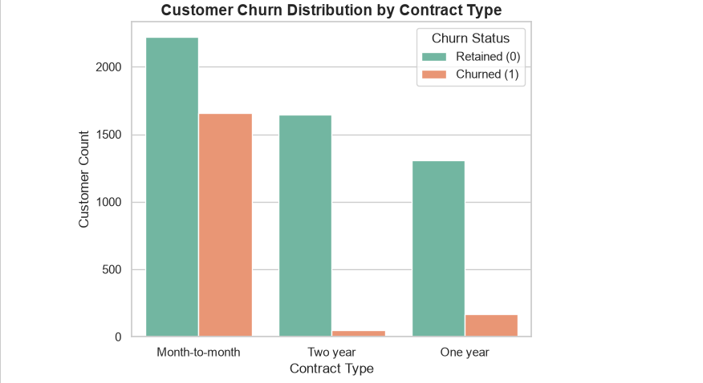
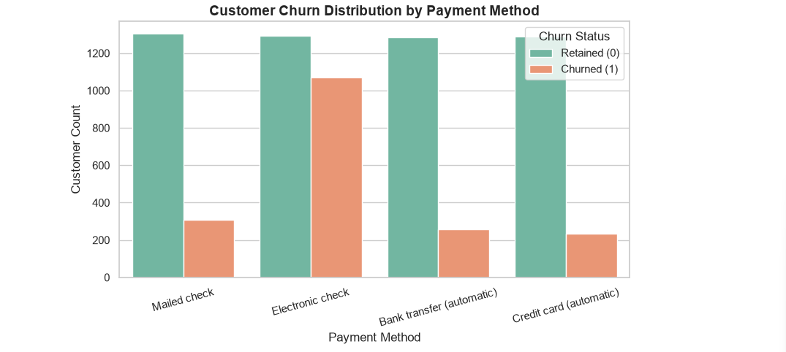

# Customer-Churn-Analysis-Business-Insights-IBM-Telco-Dataset-

# 📊 Strategic Customer Churn Analysis & Retention Framework

## 🏢 Business Context & Problem Statement
In the subscription and telecom industries, customer acquisition costs (CAC) are steep, making **customer retention** a primary driver of long-term profitability. High churn rates directly erode recurring revenue streams. 

The objective of this project was to analyze historical customer data from the **IBM Telco dataset** to answer three critical business questions:
1. **Who is leaving?** (Identifying high-risk customer segments based on contracts and billing).
2. **Why are they leaving?** (Uncovering financial sensitivities and qualitative service friction points).
3. **What can we do about it?** (Translating analytical findings into actionable, cost-effective retention strategies).

---

## 🔍 Key Findings & Analytical Insights

### 1. The Contract Trap (Structural Risk)
* **The Finding:** Month-to-month subscribers experience an alarming **42.7% churn rate**, whereas customers on two-year agreements exhibit near-total retention (**2.8% churn**).
* **Business Impact:** The business is heavily over-reliant on short-term commitments that act as a revolving door for customers, failing to build long-term loyalty hooks.


### 2. Billing & Payment Friction
* **The Finding:** Customers paying via **Electronic Check** churn at **45.3%**, more than double the rate observed across automated payment channels (Credit Card or Bank Transfer).
* **Business Impact:** Manual payment processes introduce monthly friction and drop-off points, whereas auto-pay builds passive, sticky customer habits.


### 3. Financial Pressure & Spend Sensitivity
* **The Finding:** Churned customers carry a significantly higher mean monthly charge (**$74.44**) compared to retained customers (**$61.27**).
* **Business Impact:** Higher-tier spenders expect higher value and flawless service. When service friction occurs, premium customers are the first to defect to competitors offering aggressive alternative deals.

### 4. Qualitative Exit Drivers
* **The Finding:** Customer exit logs highlight **"Attitude of support person"** and aggressive **competitor poaching** (better speed/price offers) as the dominant qualitative catalysts for cancellation. 

---

## 💡 Strategic Recommendations & Solutions

Based on these data insights, the business should implement the following targeted interventions:

* **Introduce Milestone-Based Contract Incentives:** Roll out automated promotional discounts or bundled perks at month 3 and month 6 to successfully transition volatile month-to-month users into annual commitments.
* **Frictionless Auto-Pay Migration:** Incentivize electronic check users to switch to automatic billing by offering a one-time bill credit or a minor monthly discount for setting up auto-pay.
* **Support Quality Overhaul:** Mandate empathy and communication training for support agents, specifically targeting high-tier accounts ($75+/month) who contact support multiple times to prevent churn caused by service friction.
* **Proactive Competitive Defense Tiers:** Build an automated trigger for high-value accounts showing early disengagement signals, allowing retention teams to offer speed upgrades or loyalty matching before competitors poach them.

---

## 🛠️ Project Structure & Tech Stack
* **Language:** Python
* **Environment:** Jupyter Notebook
* **Libraries:** Pandas, NumPy, Matplotlib, Seaborn

```text
├── images/                 # Visual exports (contract & payment charts)
├── notebooks/              # Complete EDA and analysis notebook
├── README.md               # Executive business summary
*Developed as part of a professional data analysis portfolio.*
